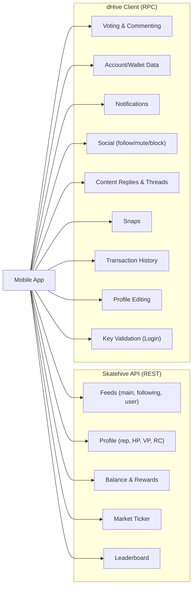

# API Audit: dHive Client vs Skatehive API

A full mapping of which mobile app features use the **dHive RPC Client** (`api.deathwing.me`) vs the **Skatehive REST API** (`api.skatehive.app`).

---

## Skatehive API (`api.skatehive.app/api/v1`)

> Used via [fetch()](file:///home/adam/Projects/skatehive/monorepo/mobileapp-skatehive/lib/hooks/useQueries.ts#34-79) in [api.ts](file:///home/adam/Projects/skatehive/monorepo/mobileapp-skatehive/lib/api.ts) and [useQueries.ts](file:///home/adam/Projects/skatehive/monorepo/mobileapp-skatehive/lib/hooks/useQueries.ts).

| Route | Feature | Used By |
|---|---|---|
| `GET /feed?page=&limit=` | Main community feed (paginated) | [getFeed()](file:///home/adam/Projects/skatehive/monorepo/mobileapp-skatehive/lib/api.ts#13-40) → Home feed, Video feed |
| `GET /feed/{user}/following` | Following feed | [getFollowing()](file:///home/adam/Projects/skatehive/monorepo/mobileapp-skatehive/lib/hive-utils.ts#1185-1212) |
| `GET /feed/{user}` | User's own posts | [useUserFeed()](file:///home/adam/Projects/skatehive/monorepo/mobileapp-skatehive/lib/hooks/useQueries.ts#245-263) |
| `GET /profile/{user}` | Profile data (rep, HP, VP, RC) | [useProfile()](file:///home/adam/Projects/skatehive/monorepo/mobileapp-skatehive/lib/hooks/useQueries.ts#190-208) |
| `GET /balance/{user}` | Balance summary | [useBalance()](file:///home/adam/Projects/skatehive/monorepo/mobileapp-skatehive/lib/hooks/useQueries.ts#174-181) → [getBalance()](file:///home/adam/Projects/skatehive/monorepo/mobileapp-skatehive/lib/api.ts#59-72) |
| `GET /balance/{user}/rewards` | Pending rewards | [useRewards()](file:///home/adam/Projects/skatehive/monorepo/mobileapp-skatehive/lib/hooks/useQueries.ts#182-189) → [getRewards()](file:///home/adam/Projects/skatehive/monorepo/mobileapp-skatehive/lib/api.ts#73-86) |
| `GET /market` | HIVE/HBD market ticker | [useMarket()](file:///home/adam/Projects/skatehive/monorepo/mobileapp-skatehive/lib/hooks/useQueries.ts#274-288) |

**Separate endpoint:**

| Route | Feature | Used By |
|---|---|---|
| `GET api.skatehive.app/api/v2/leaderboard` | Community leaderboard | [useLeaderboard()](file:///home/adam/Projects/skatehive/monorepo/mobileapp-skatehive/lib/hooks/useQueries.ts#230-244) |

---

## dHive Client (`api.deathwing.me`)

> Used via `@hiveio/dhive` `Client` in [hive-utils.ts](file:///home/adam/Projects/skatehive/monorepo/mobileapp-skatehive/lib/hive-utils.ts) and [useHiveAccount.ts](file:///home/adam/Projects/skatehive/monorepo/mobileapp-skatehive/lib/hooks/useHiveAccount.ts).

### Blockchain Writes (Transactions)

| Function | dHive Method | Feature | Used By |
|---|---|---|---|
| [vote()](file:///home/adam/Projects/skatehive/monorepo/mobileapp-skatehive/lib/hive-utils.ts#51-80) | `broadcast.sendOperations` | Upvote / Downvote posts | PostCard, Videos, ConversationReply |
| [comment()](file:///home/adam/Projects/skatehive/monorepo/mobileapp-skatehive/lib/hive-utils.ts#81-119) | `broadcast.sendOperations` | Post / Reply / Snap | create.tsx, post-utils.ts |
| [submitEncryptedReport()](file:///home/adam/Projects/skatehive/monorepo/mobileapp-skatehive/lib/hive-utils.ts#1120-1184) | `broadcast.sendOperations` | Report a post | PostCard |
| [updateProfile()](file:///home/adam/Projects/skatehive/monorepo/mobileapp-skatehive/lib/hive-utils.ts#120-146) | `broadcast.sendOperations` | Edit profile metadata | EditProfileModal |
| [setUserRelationship()](file:///home/adam/Projects/skatehive/monorepo/mobileapp-skatehive/lib/hive-utils.ts#917-963) | `broadcast.sendOperations` | Follow / Mute / Block | auth-provider, FollowersModal |

### Account & Profile Reads

| Function | dHive Method | Feature | Used By |
|---|---|---|---|
| [getBlockchainAccountData()](file:///home/adam/Projects/skatehive/monorepo/mobileapp-skatehive/lib/hive-utils.ts#558-626) | `database.getAccounts` | Full wallet data (balances, vesting, savings) | useBlockchainWallet → Wallet |
| [getProfile()](file:///home/adam/Projects/skatehive/monorepo/mobileapp-skatehive/lib/hive-utils.ts#440-454) | `bridge.get_profile` | Profile metadata | useHiveAccount |
| [convertVestToHive()](file:///home/adam/Projects/skatehive/monorepo/mobileapp-skatehive/lib/hive-utils.ts#513-537) | `database.getDynamicGlobalProperties` | VESTS → HP conversion | useVoteValue, Wallet |
| [validate_posting_key()](file:///home/adam/Projects/skatehive/monorepo/mobileapp-skatehive/lib/hive-utils.ts#358-416) | `database.getAccounts` | Login key validation | auth-provider |

### Content Reads

| Function | dHive Method | Feature | Used By |
|---|---|---|---|
| [getContent()](file:///home/adam/Projects/skatehive/monorepo/mobileapp-skatehive/lib/hive-utils.ts#313-328) | `database.get_content` | Single post/comment data | ConversationDrawer, NotificationItem |
| [getContentReplies()](file:///home/adam/Projects/skatehive/monorepo/mobileapp-skatehive/lib/hive-utils.ts#274-286) | `database.get_content_replies` | Comment thread replies | useReplies, useSnaps |
| [getDiscussions()](file:///home/adam/Projects/skatehive/monorepo/mobileapp-skatehive/lib/hive-utils.ts#287-312) | `database.get_discussions_by_{type}` | Trending/Hot/New discussions | useSnaps |
| [getUserComments()](file:///home/adam/Projects/skatehive/monorepo/mobileapp-skatehive/lib/hive-utils.ts#455-512) | `database.get_discussions_by_author_before_date` | User's comment history | useUserComments |
| [getSnapsContainers()](file:///home/adam/Projects/skatehive/monorepo/mobileapp-skatehive/lib/hive-utils.ts#255-273) | `database.get_discussions_by_author_before_date` | Snaps container posts | useSnaps |
| `getUserPostsByAuthor()` | `bridge.get_account_posts` | User posts with offset | index.tsx (login prefetch) |
| [getBlockchainRewards()](file:///home/adam/Projects/skatehive/monorepo/mobileapp-skatehive/lib/hive-utils.ts#627-753) | `database.get_discussions_by_author_before_date` | Active posts for rewards | useBlockchainWallet → Wallet |

### Social & Notifications

| Function | dHive Method | Feature | Used By |
|---|---|---|---|
| [fetchAllNotifications()](file:///home/adam/Projects/skatehive/monorepo/mobileapp-skatehive/lib/hive-utils.ts#815-859) | `bridge.account_notifications` | All notifications | useNotifications |
| [fetchNewNotifications()](file:///home/adam/Projects/skatehive/monorepo/mobileapp-skatehive/lib/hive-utils.ts#860-890) | `bridge.account_notifications` | Unread notification count | useNotificationBadge, notifications-context |
| [getFollowing()](file:///home/adam/Projects/skatehive/monorepo/mobileapp-skatehive/lib/hive-utils.ts#1185-1212) | `database.get_following` | Following list | FollowersModal |
| [getFollowers()](file:///home/adam/Projects/skatehive/monorepo/mobileapp-skatehive/lib/hive-utils.ts#1241-1268) | `database.get_followers` | Followers list | FollowersModal |
| [getMuted()](file:///home/adam/Projects/skatehive/monorepo/mobileapp-skatehive/lib/hive-utils.ts#1213-1240) | `database.get_following` (type: ignore) | Muted users list | FollowersModal |
| [getUserRelationshipList()](file:///home/adam/Projects/skatehive/monorepo/mobileapp-skatehive/lib/hive-utils.ts#1004-1058) | `follow_api.get_following` | Bulk relationship list | auth-provider |
| [getRelationship()](file:///home/adam/Projects/skatehive/monorepo/mobileapp-skatehive/lib/hive-utils.ts#964-1003) | `bridge.get_relationship_between_accounts` | Check follow/mute status | hive-utils |
| [getFollowCount()](file:///home/adam/Projects/skatehive/monorepo/mobileapp-skatehive/lib/hive-utils.ts#1269-1286) | `database.get_follow_count` | Follower/Following counts | hive-utils |

### Wallet & Financial

| Function | dHive Method | Feature | Used By |
|---|---|---|---|
| `fetchAccountHistory()` | `account_history_api.get_account_history` | Transaction history | Wallet |
| Vote value calc | `database.get_reward_fund`, `get_feed_history` | Estimated vote $ value | useVoteValue |

---

## Summary Diagram

---

## Key Observations

> [!IMPORTANT]
> The **dHive Client** handles the vast majority of features (~25+ functions). The **Skatehive API** covers only ~7 routes, primarily for read-only feed aggregation and pre-computed profile/balance data.

> [!NOTE]
> The wallet screen uses **dHive exclusively** ([getBlockchainAccountData](file:///home/adam/Projects/skatehive/monorepo/mobileapp-skatehive/lib/hive-utils.ts#558-626), [getBlockchainRewards](file:///home/adam/Projects/skatehive/monorepo/mobileapp-skatehive/lib/hive-utils.ts#627-753), `fetchAccountHistory`), even though there's a [getBalance()](file:///home/adam/Projects/skatehive/monorepo/mobileapp-skatehive/lib/api.ts#59-72) function in the Skatehive API. The Skatehive API balance is used on the profile tab, not the wallet.

> [!TIP]
> **Potential consolidation**: Snaps, content replies, notifications, and social lists could potentially be migrated to the Skatehive API (via HAFSQL) to reduce direct RPC dependency and improve caching/performance.
